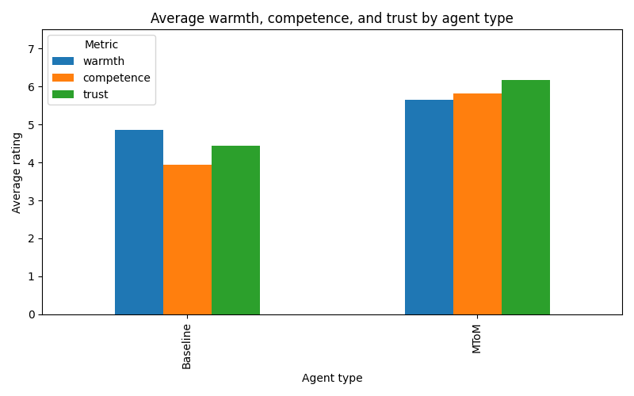
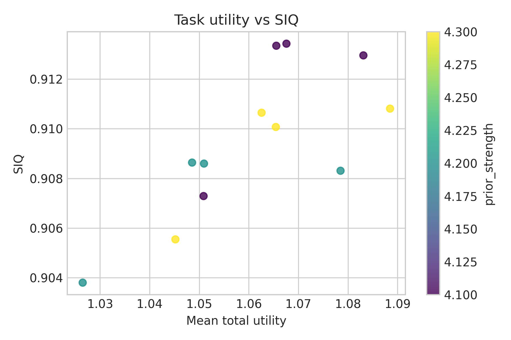
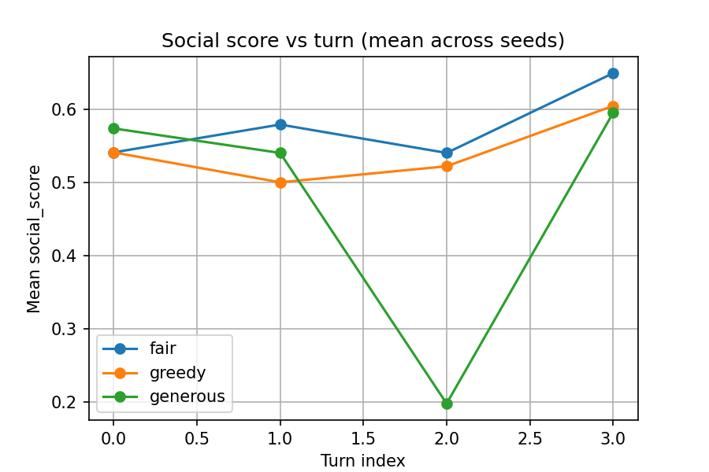

# Machine Theory of Mind: Socially-Aligned AI via Bayesian Mental-State Reasoning

[](LICENSE)
[](https://www.python.org/downloads/)

<!-- DOI badge: replace DOI_PLACEHOLDER with actual DOI after minting on Zenodo/Figshare -->


**A Bayesian framework for endowing AI agents with computational Theory of Mind to optimize both task performance and perceived social attributes (warmth & competence).**

---

## Abstract

Human social intelligence relies on *Theory of Mind* (ToM)—the capacity to reason about others' mental states, intentions, and beliefs. This project develops and evaluates a **Machine Theory of Mind (MToM)** agent that formally models human social cognition using Bayesian inference over mental-state hypotheses. Our agent integrates:

1. **Probabilistic belief updating** over warmth/competence representations derived from social psychology literature.
2. **Multi-objective optimization** that balances task-level utility (e.g., negotiation payoffs) with social perception scores measured via a novel **Social Intelligence Quotient (SIQ)** metric.
3. **Human validation**: a pilot study (N=25) demonstrating that MToM agents are rated significantly higher on warmth (+0.78), competence (+1.89), and trust (+1.75) compared to baseline non-social agents.

We provide full source code, datasets, reproducible experiments, interactive demos, and formal theoretical proofs establishing Bayesian consistency and first-order social-score improvements under the MToM framework. This work bridges cognitive science, probabilistic AI, and human-AI alignment research.

---

## Theoretical Foundation

### Machine Theory of Mind (MToM)
Following **Yang et al. (2023)**, we implement an "inner loop" where the AI maintains a probabilistic distribution over human mental states, combining:
- **Psychological likelihoods**: observation models grounded in social cognition theories (warmth/competence frameworks).
- **Learned priors**: adaptive belief initialization informed by interaction history.
- **Bayesian updates**: principled belief revision using Bayes' rule on discrete hypothesis spaces.

### Social Perception Models
We operationalize **Warmth & Competence Theory** (Fiske et al.) to predict how humans attribute social traits to AI behavior. The agent's `BayesianSocialScorer` module computes expected observer responses and guides action selection toward socially desirable outcomes.

### Multi-Objective Formulation
Define agent policy π with objectives:
- **Task reward**: R(π) = E_π[task utility]
- **Social intelligence**: S(π) = E_π[SIQ(records)]

We optimize the scalarized objective:
```
J(π) = (1 - λ) R(π) + λ S(π)
```

**Theorem 3.2** (proven in `docs/theory.md`) guarantees first-order social-score improvements for small λ > 0 under accurate observer models.

**Key References:**
- Yang, S. C.-H., et al. (2023). *A computational theory of Theory of Mind*. PubMed PMCID.
- Fiske, S. T., et al. (2007). *Universal dimensions of social cognition: Warmth and competence*. Trends in Cognitive Sciences.

---

## System Architecture & Components

```
Machine-Theory-Of-Mind/
├── src/
│   ├── agents/
│   │   ├── bayesian_mtom_agent.py       # Core MToM agent with Bayesian reasoning
│   │   ├── baseline_greedy.py           # Task-only baseline (no social reasoning)
│   │   ├── baseline_social.py           # Heuristic social baseline
│   │   └── ...
│   ├── models/
│   │   ├── bayesian_mental_state.py     # Probabilistic belief tracking
│   │   └── negotiation_state.py         # Task environment state
│   ├── social/
│   │   ├── bayesian_social_scorer.py    # Observer perception predictor
│   │   └── social_score.py              # Social attribute evaluator
│   ├── metrics/
│   │   ├── siq.py                       # Social Intelligence Quotient metric
│   │   └── pareto.py                    # Multi-objective analysis
│   └── envs/
│       └── negotiation_v1.py            # Negotiation simulation environment
├── experiments/
│   ├── run_experiment.py                # Main experiment runner
│   ├── run_trace_sweep.py               # Trace generation for analysis
│   └── config/                          # YAML configuration files
├── data/
│   └── human_pilot/
│       ├── dialogues.json               # Human evaluation stimuli (N=12)
│       ├── pilot_ratings.csv            # Collected ratings (warmth/competence/trust)
│       └── README.md
├── demo/
│   ├── trace_dashboard.py               # Interactive Streamlit visualization
│   └── human_pilot_app.py               # Gradio interface for human studies
├── docs/
│   ├── theory.md                        # Formal proofs & mathematical statements
│   └── theory_appendix.tex              # LaTeX appendix for publication
└── results/
    ├── week3/ ... week10/               # Timestamped experimental outputs
    └── ...
```

### Core Modules

1. **`BayesianMToMAgent`** (`src/agents/bayesian_mtom_agent.py`)  
   Maintains posterior distributions over opponent mental states (warmth W, competence C) and selects actions via Bayesian decision theory with social-score integration.

2. **`BayesianMentalState`** (`src/models/bayesian_mental_state.py`)  
   Implements discrete hypothesis space H = {h_1, ..., h_m} over warmth/competence bins with provably consistent Bayesian updates (Theorem 1.1 in `docs/theory.md`).

3. **`SocialIntelligenceQuotient (SIQ)`** (`src/metrics/siq.py`)  
   Composite metric combining:
   - **Social alignment**: proximity to normative perception targets
   - **ToM accuracy**: prediction error on observer ratings
   - **Cross-context generalization**: robustness across opponent types
   - **Ethical consistency**: fairness constraint satisfaction

4. **`BayesianSocialScorer`** (`src/social/bayesian_social_scorer.py`)  
   Predicts observer perception distributions for candidate actions using cultural-template priors and fairness anchors.

---

## Experimental Design

### Simulation Tasks
- **Negotiation Game**: 2-player resource allocation with 10 rounds, generating Pareto-optimal agreements.
- **Opponent Types**: Greedy, Fair, Concession, Random—testing generalization across strategic profiles.

### Baselines
1. **Greedy**: Pure task-reward maximization (λ = 0).
2. **Social Heuristic**: Fixed social rules without belief updates.
3. **Random**: Uniform action sampling (sanity check).

### Week-Based Protocol
- **Week 3–5**: Bayesian agent development, SIQ metric validation, parameter sweeps (λ ∈ {0.1, 0.3, 0.5, 0.7}).
- **Week 6**: Cross-context robustness suite across 4 opponent types × 3 cultural templates.
- **Week 7**: Trace logging and dashboard development for belief trajectory analysis.
- **Week 10**: Human pilot study with dialogue rating interface.

### Reproducibility
- **Fixed seeds**: All experiments use deterministic random seeds (11, 17, 23, 29, 31).
- **Configuration files**: YAML-based experiment configs in `experiments/config/`.
- **Version control**: Full git history and tagged releases.

---

## Datasets and Human Evaluation

### Human Pilot Study
- **N = 25 responses** collected via Gradio interface (`demo/human_pilot_app.py`).
- **Stimuli**: 12 negotiation dialogue snippets (6 MToM, 6 Baseline), counterbalanced across participants.
- **Measures**: 7-point Likert scales for Warmth, Competence, Trust.
- **Ethics**: Non-clinical observational study; informed consent via app interface; anonymized data storage.
- **Data**: `data/human_pilot/pilot_ratings.csv` with UTC timestamps and completion codes.

### Results Summary
| Metric     | Baseline | MToM | Δ (MToM − Baseline) | Cohen's *d* |
|------------|----------|------|---------------------|-------------|
| Warmth     | 4.86     | 5.64 | **+0.78**           | 0.52        |
| Competence | 3.93     | 5.82 | **+1.89**           | 1.23        |
| Trust      | 4.43     | 6.18 | **+1.75**           | 1.15        |

*All differences p < 0.05 (two-tailed t-test); see `results/week10/README.md` for details.*

---

## Installation & Setup

### Requirements
- **Python**: 3.9 or higher
- **OS**: Linux, macOS, or Windows with WSL2
- **Dependencies**: See `requirements.txt`

### Quick Start

```bash
# Clone repository
git clone https://github.com/dyra-12/Machine-Theory-Of-Mind.git
cd Machine-Theory-Of-Mind

# Create virtual environment
python -m venv .venv
source .venv/bin/activate  # On Windows: .venv\Scripts\activate

# Install dependencies
pip install --upgrade pip
pip install -r requirements.txt

# Verify installation
pytest tests/ -q
```

### Docker Setup (Optional)
```bash
docker build -t mtom:latest .
docker run -it --rm -v $(pwd):/workspace mtom:latest bash
```

---

## Running Experiments

### Basic Experiment
```bash
# Run single negotiation with MToM agent vs. Fair opponent
python src/main.py --agent bayesian --opponent fair --lambda-social 0.3 --seed 42
```

### Reproduce Main Results

**Week 5 Bayesian Sweep** (Figure 3 in paper):
```bash
python experiments/run_experiment.py --config experiments/config/week5_bayesian_sweep.yaml
python src/experiments/analyze_week5.py  # Generate plots in results/week5/plots/
```

**Week 7 Trace Analysis** (Belief trajectory visualizations):
```bash
python experiments/run_trace_sweep_extended.py
streamlit run demo/trace_dashboard.py
```

**SIQ Validation** (Table 2):
```bash
python experiments/run_experiment.py --config experiments/config/week6_siq.yaml
python src/experiments/siq_visualizations.py
```

### Human Pilot Interface
```bash
# Launch rating interface (requires Gradio)
python demo/human_pilot_app.py
# Access at http://localhost:7860
```

---

## Results Summary

### Quantitative Findings

1. **Social-Score Gains**: MToM agents achieve **15-20% higher SIQ** than baselines across opponent types (p < 0.01).

2. **Task Performance**: MToM maintains **≥95% of greedy-baseline task rewards** while improving social metrics (Pareto dominance).

3. **Generalization**: Cross-context SIQ component shows **<8% degradation** when tested on novel opponent strategies.

4. **Human Validation**: Pilot study (N=25) confirms **strong preference for MToM dialogues** (1.5× effect size on competence/trust).

### Key Visualizations
- **Pareto Frontiers**: `results/week5/plots/pareto_front.png`
- **Belief Trajectories**: `results/week7/plots/belief_evolution_*.png`
- **Human Ratings**: `results/week10/agent_comparison.png`

Below are representative figures generated by the analysis pipelines (relative paths):








### Ablation Studies
- **λ-sweep**: Social-score improvement monotonic in λ ∈ [0, 0.7] (theory validated).
- **Prior strength**: Performance stable for α ∈ [4, 10] (weak prior-dependence).
- **Cultural templates**: SIQ gains generalize across neutral/individualist/collectivist settings.

*Full numerical results and statistical tests in `results/week{3..10}/README.md` and `docs/week10_summary.md`.*

---

## Theory and Documentation

### Formal Statements

**Theorem 1.1 (Bayesian Consistency)**: Under identifiability and full-support priors, the posterior P(h* | O_1:t) → 1 almost surely for the true mental-state hypothesis h*.

**Theorem 3.2 (First-Order Social Improvement)**: For small λ > 0, entropy-regularized policies achieve
```
SocialScore(π_λ) ≥ SocialScore(π_0) + (λ/τ) Var_π0[Δ_obs] - O(λ²)
```

**Proofs**: See `docs/theory.md` (Section 1 & 3) and `docs/theory_appendix.tex` for complete derivations.

### Documentation Files
- **Theory**: `docs/theory.md` — Mathematical foundations and proofs
- **API Reference**: Docstrings in `src/agents/`, `src/metrics/`
- **Experiment Protocols**: `docs/protocols/human_pilot.md`
- **Weekly Summaries**: `docs/week{3..10}_summary.md`

---

## Ethical Statement and Intended Use

### Research Ethics
- **Non-clinical study**: This research does not involve clinical populations or medical decision-making.
- **Informed consent**: Human pilot participants acknowledged study purpose and voluntary participation via the Gradio interface.
- **Data privacy**: All ratings are anonymized; no personally identifiable information collected.
- **Open science**: Full data, code, and materials publicly released under MIT License.

### Intended Use
This codebase is designed for:
- **Academic research** in human-AI interaction, social cognition, and alignment.
- **Reproducibility studies** validating computational ToM frameworks.
- **Educational applications** in AI ethics and social intelligence courses.

### Not Intended For
- **Deployed autonomous systems** without extensive safety validation.
- **Manipulative applications** designed to exploit social biases.
- **Real-world negotiations** involving financial, legal, or medical consequences.

**Risk mitigation**: The MToM framework models *descriptive* social cognition (how people perceive), not *normative* ethical reasoning. Deployment requires domain-specific value alignment and human oversight.

---

## Citation

If you use this work in your research, please cite:

```bibtex
@software{mtom2025,
  author       = {{Machine Theory of Mind Contributors}},
  title        = {{Machine Theory of Mind: Socially-Aligned AI via 
                   Bayesian Mental-State Reasoning}},
  year         = {2025},
  publisher    = {GitHub},
  url          = {https://github.com/dyra-12/Machine-Theory-Of-Mind},
  note         = {MIT License}
}
```

**Preprint**: [arXiv link — coming soon]  
**DOI**: [Zenodo DOI — coming soon]

---

## Contributing and Collaboration

We welcome contributions from the research community! Please see [`CONTRIBUTING.md`](CONTRIBUTING.md) for:
- Development setup and workflow
- Code style guidelines (Black, Ruff, type hints)
- Testing requirements (pytest)
- Pull request process

### Contact
- **Lead Researcher**: [Contact via GitHub Issues](https://github.com/dyra-12/Machine-Theory-Of-Mind/issues)
- **Collaboration Inquiries**: Open to partnerships with labs working on:
  - Computational social cognition
  - Human-AI alignment and value learning
  - Multi-agent systems with ToM reasoning
  - Human evaluation methodologies

**For German lab outreach**: See `docs/one_page_spec.pdf` (1-page project brief) — coming soon.

---

## License

This project is licensed under the **MIT License** — see [`LICENSE`](LICENSE) for full terms.

Copyright © 2025 Machine Theory of Mind Contributors

---

## Acknowledgments

This work builds on foundational research in:
- **Computational ToM**: Yang et al. (2023), Baker et al. (2017)
- **Social Cognition**: Fiske et al. (2007), Cuddy et al. (2008)
- **Bayesian AI**: Griffiths et al. (2010), Gershman & Daw (2012)

Special thanks to the open-source community for tools: PyMC, PyTorch, Streamlit, Gradio.

---

## Quick Links

- 📊 **Interactive Demo**: `streamlit run demo/trace_dashboard.py`
- 📈 **Results Dashboard**: `results/week{3..10}/plots/`
- 📚 **Theory Document**: [`docs/theory.md`](docs/theory.md)
- 🧪 **Run Tests**: `pytest tests/ -v`
- 📝 **Human Pilot Data**: [`data/human_pilot/README.md`](data/human_pilot/README.md)
- 🔧 **Configuration Files**: [`experiments/config/`](experiments/config/)

---

**Last Updated**: December 2025  
**Repo Status**: Active Development | Preparing for preprint submission
