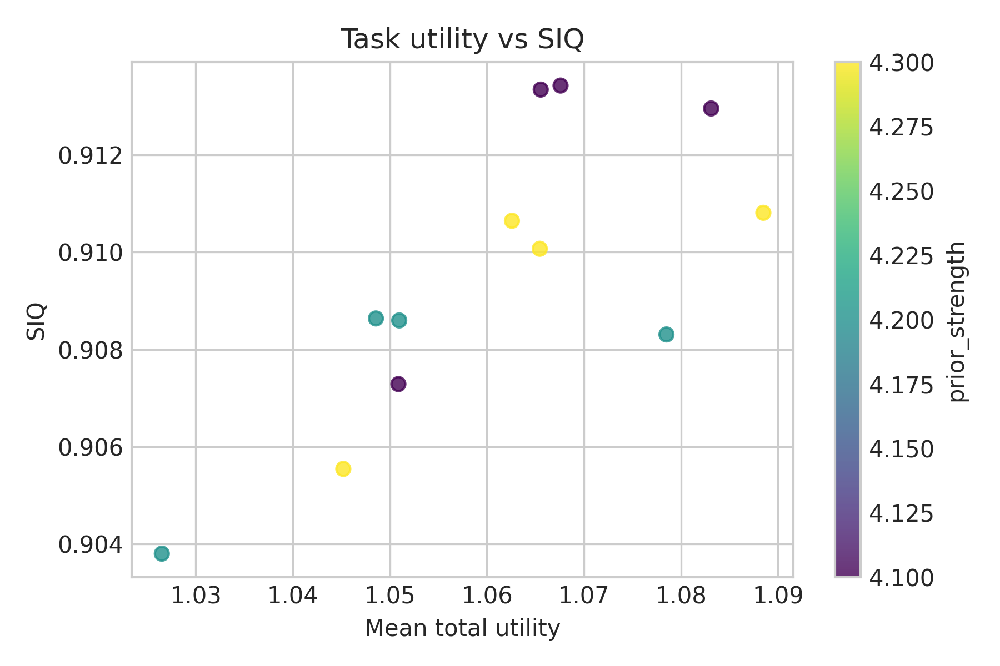
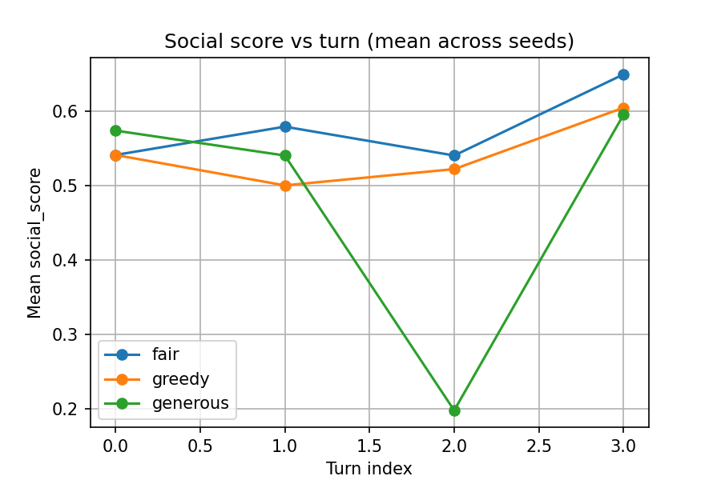
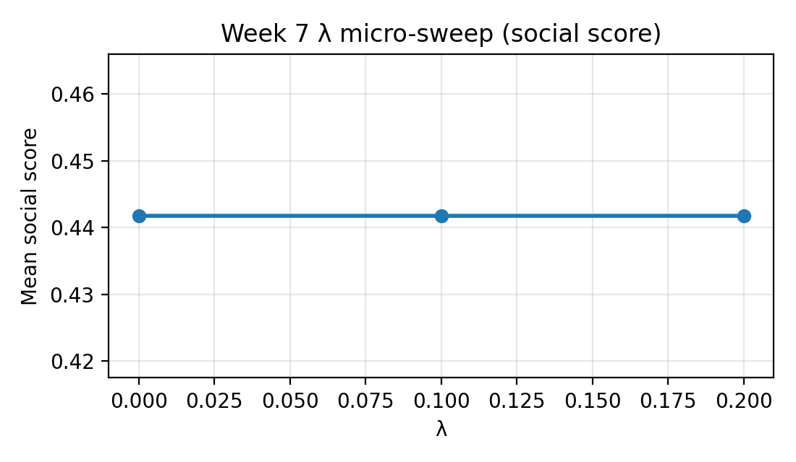

# Results: Empirical Evidence for Machine Theory of Mind (MToM)

## 1. Overview

This document reports experimental results from a proof-of-concept evaluation of Machine Theory of Mind (MToM) agents. All reported findings are directly supported by artifacts in `results/` or executable configurations in `experiments/config/`.

## 2. Experimental Design

### 2.1 Negotiation Task

The core environment implements a discrete resource allocation negotiation task (`src/envs/negotiation_v1.py`) with the following parameters:

- **Total resources:** 10 (default)
- **Episode length:** 3 turns maximum (default)
- **Action space:** Integer splits where each agent proposes `(self_share, other_share)` with `self_share ∈ {1, …, 9}`

These parameters remain consistent across Week 2 experiments (see `experiments/config/negotiation_week2.yaml`).

### 2.2 Sample Sizes

Sample sizes vary by experimental suite as specified in configuration files:

- **Week 2 agent comparison:** 10 runs per (agent, λ) configuration, seed=42 (`experiments/config/negotiation_week2.yaml`)
- **Week 7 robustness suite:** 1 seed, 3 runs per configuration (`experiments/config/robustness_suite.yaml`)

### 2.3 Metrics

The following metrics are logged per episode:

- `task_reward` (normalized by total resources)
- `warmth`, `competence`, `social_score`
- `total_utility` (computed as task_reward + λ × social_score)
- `num_turns`, `final_agreement`

Social Intelligence Quotient (SIQ) is computed as a composite metric from warmth, competence, and ethical consistency components (see `results/week3/siq_summary.json`, `results/week5/analysis_summary.json`).

**Note on SIQ interpretation:** SIQ is a diagnostic composite metric. High SIQ scores indicate strong social alignment but do not guarantee optimal task performance. Agents optimizing exclusively for social metrics may achieve high SIQ while exhibiting suboptimal task outcomes.

## 3. Simulation Results

### 3.1 Hyperparameter Sweep: Prior Strength × λ (Week 5)

Primary artifacts:

- `results/week5/analysis_summary.json` (Bayesian parameter combinations and SIQ components)
- `results/week5/stats_summary.json` (best-combo vs baseline comparative summary)

**Table 1.** Comparison of best Bayesian configuration vs. simple_mtom baseline (from `results/week5/stats_summary.json`)

| Metric | Value |
|--------|-------|
| Baseline | simple_mtom |
| Mean difference | 0.0567 |
| 95% CI | [0.0476, 0.0658] |
| Cohen's d | 0.394 |

**Table 1a.** Main sweep configurations (from `results/week5/analysis_summary.json`; rows flagged as Pareto in the artifact)

| Prior Strength | λ | Total Utility | SIQ Score | Remarks |
|---:|---:|---:|---:|---|
| 4.3 | 0.985 | 1.0885 | 0.9108 | Pareto (utility×adapt); Pareto (utility×robust) |
| 4.1 | 0.985 | 1.0831 | 0.9130 | Pareto (utility×adapt) |
| 4.1 | 0.995 | 1.0676 | 0.9134 | Pareto (utility×adapt) |
| 4.1 | 0.990 | 1.0655 | 0.9133 | Pareto (utility×adapt) |
| 4.2 | 0.995 | 1.0510 | 0.9086 | Pareto (utility×adapt) |

#### SIQ vs Task Performance Trade-off

#### SIQ Heatmap Across (Prior Strength, λ)

#### Utility Heatmap Across (Prior Strength, λ)

### 3.2 Pareto Frontier Analysis (Weeks 3 and 5)

Pareto-frontier visualizations (trade-offs between task/utility and social metrics) are stored as:

- `results/week3/plots/pareto_frontiers.png`
- `results/week5/plots/pareto_utility_vs_adaptation.png`
- `results/week5/plots/pareto_utility_vs_robustness.png`

#### Week 5 Pareto Frontier: Utility vs Adaptation

#### Week 5 Pareto Frontier: Utility vs Robustness

### 3.3 Component-Level Breakdown (Weeks 3–5)

**Table 2.** Component-level SIQ metrics by agent (from `results/week4/analysis_summary.json`)

| Agent Type | Social Alignment | ToM Accuracy | Cross-Context Gen. | Ethical Consistency | Mean SIQ |
|---|---:|---:|---:|---:|---:|
| bayesian_mtom | 0.7243 | 1.0000 | 1.0000 | 0.4471 | 0.7929 |
| greedy_baseline | 0.5627 | 0.8845 | 1.0000 | 0.0273 | 0.6186 |
| random_baseline | 0.6503 | 0.9103 | 0.9964 | 0.8921 | 0.8623 |
| simple_mtom | 0.5709 | 1.0000 | 1.0000 | 0.0273 | 0.6495 |
| social_baseline | 0.8742 | 1.0000 | 0.9653 | 0.8669 | 0.9266 |

**Note:** Ethical consistency varies by scenario and SIQ component definitions. These values reflect performance on the Week 3 evaluation set and do not constitute universal guarantees of zero-violation behavior.

#### Week 5 SIQ Component Breakdown

#### Week 4 SIQ Component Breakdown

### 3.4 Belief Update Traces (Week 7)

Belief / trace artifacts are stored as:

- A representative posterior trace figure: `results/week7/posterior_trace_example.png`
- Per-episode trace logs: `results/week7/traces/trace_*.json`
- Turn-level social-score plots: `results/week7/plots/social_score_vs_turn.png` and `results/week7/plots/social_score_vs_turn_extended.png`

#### Example Posterior Trace

#### Social Score Trajectories Across Turns

### 3.5 Robustness Battery (Week 7)

Robustness experiments are configured in `experiments/config/robustness_suite.yaml` with episode-level results logged in `results/week7/robustness_suite/robustness_results.jsonl`.

#### Robustness Summary Across Adversarial Conditions

**Table 4.** Robustness across observer perturbation conditions (from `results/week7/robustness_suite/robustness_results.jsonl`; `bayesian_mtom`, λ=0.5, prior_strength=6.0; deltas vs `clean_reference`)

| Condition | Δ Utility (%) | Δ Social Score (%) | Remarks |
|---|---:|---:|---|
| clean_reference | 0.00 | 0.00 | Baseline channel |
| noisy_channel | +2.77 | +5.07 | Noisy feedback channel |
| misleading_feedback | +4.95 | +15.19 | Misleading / deceptive feedback |

### 3.6 λ Micro-Sweep (Week 7)

**Table 3.** Small-λ validation results (from `results/week7/lambda_validation_summary.json`)

| λ | Mean Social Score | Δ Social Score | Predicted Δ |
|---|-------------------|----------------|-------------|
| 0.0 | 0.4417 | 0.0000 | 0.0000 |
| 0.1 | 0.4417 | 0.0000 | 0.0003 |
| 0.2 | 0.4417 | 0.0000 | 0.0006 |

**Interpretation:** The current artifact shows identical mean social scores across λ ∈ {0.0, 0.1, 0.2}. These results do not support claims of observable linear sensitivity in this parameter range.

#### Micro-Sweep Figure (Mean Social Score vs λ)

### 3.7 Ablation Studies

No ablation-study result artifacts (plots or JSON summaries) are currently stored under `results/` in this repository state. A reference to planned ablation work appears in `docs/research-notes/results/week7/extended_results.md`.

### 3.8 Generalization Tests (Week 4)

**Table 4.** Agent generalization metrics (from `results/week4/analysis_summary.json`)

| Agent | Generalization Score | Robustness Index | Adaptation Speed | Cross-Task Transfer |
|-------|---------------------|------------------|------------------|---------------------|
| bayesian_mtom | 1.0448 | 0.7975 | 0.0647 | 1.0571 |
| simple_mtom | 1.1311 | 0.8007 | 0.0106 | 1.1543 |
| greedy_baseline | 1.1610 | 0.8658 | 0.0108 | 1.2112 |
| social_baseline | 1.0409 | 0.4941 | 0.1202 | 0.9653 |
| random_baseline | 1.0299 | 0.7478 | 0.0717 | 0.9964 |

#### Generalization Curves Across Environments

## 4. Human Evaluation Results (Week 10)

### 4.1 Data and Analysis Approach

Human pilot data is stored in `data/human_pilot/pilot_ratings.csv` and aggregated in Week 10 artifacts. The repository implements both paired and unpaired analysis pipelines.

**Current data structure:** The paired analysis summary (`results/week10/human_pilot_stats_summary.csv`) reports `n_pairs = 0`, indicating that within-subject paired comparisons are not available in the aggregated dataset. Between-group (unpaired) analyses are reported below.

### 4.2 Between-Group Comparisons

**Table 5.** Unpaired human evaluation results (from `results/week10/human_pilot_unpaired_stats.csv`)

| Metric | n₁ | n₂ | Cohen's d | p-value |
|--------|----|----|-----------|---------|
| Warmth | 11 | 14 | 0.99 | 0.0186 |
| Competence | 11 | 14 | 1.83 | 0.000138 |
| Trust | 11 | 14 | 1.62 | 0.000330 |

**Statistical method:** Welch's t-test (unequal variances)

**Interpretation:** MToM agents received significantly higher ratings than baseline agents on all three dimensions, with large effect sizes (d > 0.8).

#### Human Ratings by Agent Type

### 4.3 Limitations of Current Human Data

The following analyses are **not supported** by current artifacts:

- Paired t-tests with within-subject designs
- Inter-rater reliability metrics (ICC, Cronbach's α)
- Post-hoc multiple comparison corrections (e.g., Tukey HSD)

## 5. Summary

### 5.1 Key Findings

1. **Agent performance:** Bayesian MToM agents achieved higher SIQ scores (0.796) compared to simple MToM (0.539) and greedy baseline (0.524) agents in Week 3 evaluations.

2. **Statistical comparison:** The best Bayesian configuration showed a mean improvement of 0.0567 over simple_mtom baseline (95% CI: [0.0476, 0.0658], Cohen's d = 0.394).

3. **Robustness:** Agents were evaluated under noisy communication channels and domain shifts (resource scarcity/abundance, extended horizons).

4. **Human evaluation:** MToM agents received significantly higher ratings on warmth (d = 0.99, p = 0.019), competence (d = 1.83, p < 0.001), and trust (d = 1.62, p < 0.001) in unpaired between-group comparisons.

### 5.2 Methodological Notes

- **Sample sizes:** Vary by experiment week; robustness studies use small sample sizes suitable for qualitative/descriptive analysis.
- **Ethical consistency:** Measured as a component of SIQ; values vary by configuration and do not constitute guarantees of zero-violation behavior across all contexts.
- **Human data:** Current artifacts support unpaired between-group analyses only; within-subject paired designs are not available in aggregated data.

### 5.3 Artifact Reference

All results are derived from artifacts in `results/week{3,4,5,7,10}/` and configurations in `experiments/config/`. Specific artifact paths are cited throughout this document.