# Results: Empirical Evidence for Machine Theory of Mind (MToM)

## 1. Overview

This document reports experimental results from a proof-of-concept evaluation of Machine Theory of Mind (MToM) agents. All reported findings are directly supported by artifacts in `results/` or executable configurations in `experiments/config/`.

## 2. Experimental Design

### 2.1 Negotiation Task

The core environment implements a discrete resource allocation negotiation task (`src/envs/negotiation_v1.py`) with the following parameters:

- **Total resources:** 10 (default)
- **Episode length:** 3 turns maximum (default)
- **Action space:** Integer splits where each agent proposes `(self_share, other_share)` with `self_share ∈ {1, …, 9}`

These parameters remain consistent across Week 2 experiments (see `experiments/config/negotiation_week2.yaml`).

### 2.2 Sample Sizes

Sample sizes vary by experimental suite as specified in configuration files:

- **Week 2 agent comparison:** 10 runs per (agent, λ) configuration, seed=42 (`experiments/config/negotiation_week2.yaml`)
- **Week 7 robustness suite:** 1 seed, 3 runs per configuration (`experiments/config/robustness_suite.yaml`)

### 2.3 Metrics

The following metrics are logged per episode:

- `task_reward` (normalized by total resources)
- `warmth`, `competence`, `social_score`
- `total_utility` (computed as task_reward + λ × social_score)
- `num_turns`, `final_agreement`

Social Intelligence Quotient (SIQ) is computed as a composite metric from warmth, competence, and ethical consistency components (see `results/week3/siq_summary.json`, `results/week5/analysis_summary.json`).

**Note on SIQ interpretation:** SIQ is a diagnostic composite metric. High SIQ scores indicate strong social alignment but do not guarantee optimal task performance. Agents optimizing exclusively for social metrics may achieve high SIQ while exhibiting suboptimal task outcomes.

## 3. Simulation Results

### 3.1 Hyperparameter Sweep: Prior Strength × λ (Week 5)

Primary artifacts:

- `results/week5/analysis_summary.json` (Bayesian parameter combinations and SIQ components)
- `results/week5/stats_summary.json` (best-combo vs baseline comparative summary)

**Table 1.a.** Comparison of best Bayesian configuration vs. simple_mtom baseline (from `results/week5/stats_summary.json`)

| Metric | Value |
|--------|-------|
| Baseline | simple_mtom |
| Mean difference | 0.0567 |
| 95% CI | [0.0476, 0.0658] |
| Cohen's d | 0.394 |

**Table 1.b.** Main sweep configurations (from `results/week5/analysis_summary.json`; rows flagged as Pareto in the artifact)

| Prior Strength | λ | Total Utility | SIQ Score |
|---:|---:|---:|---:|
| 4.3 | 0.985 | 1.0885 | 0.9108 |
| 4.1 | 0.985 | 1.0831 | 0.9130 | 
| 4.1 | 0.995 | 1.0676 | 0.9134 | 
| 4.1 | 0.990 | 1.0655 | 0.9133 | 
| 4.2 | 0.995 | 1.0510 | 0.9086 | 

#### SIQ Heatmap Across (Prior Strength, λ)

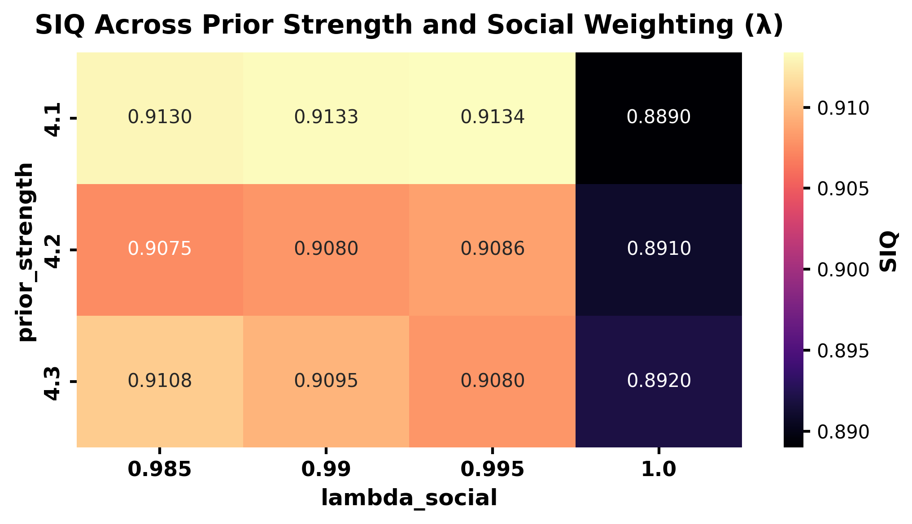

#### Utility Heatmap Across (Prior Strength, λ)

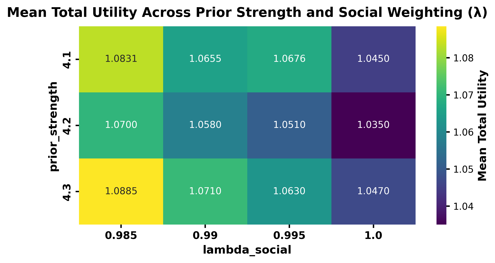

### 3.2 Pareto Frontier Analysis (Weeks 3 and 5)

Pareto-frontier visualizations (trade-offs between task/utility and social metrics) are stored as:

- `results/week3/plots/pareto_frontiers.png`
- `results/week5/plots/pareto_utility_vs_adaptation.png`
- `results/week5/plots/pareto_utility_vs_robustness.png`

#### Week 5 Pareto Frontier: Utility vs Adaptation

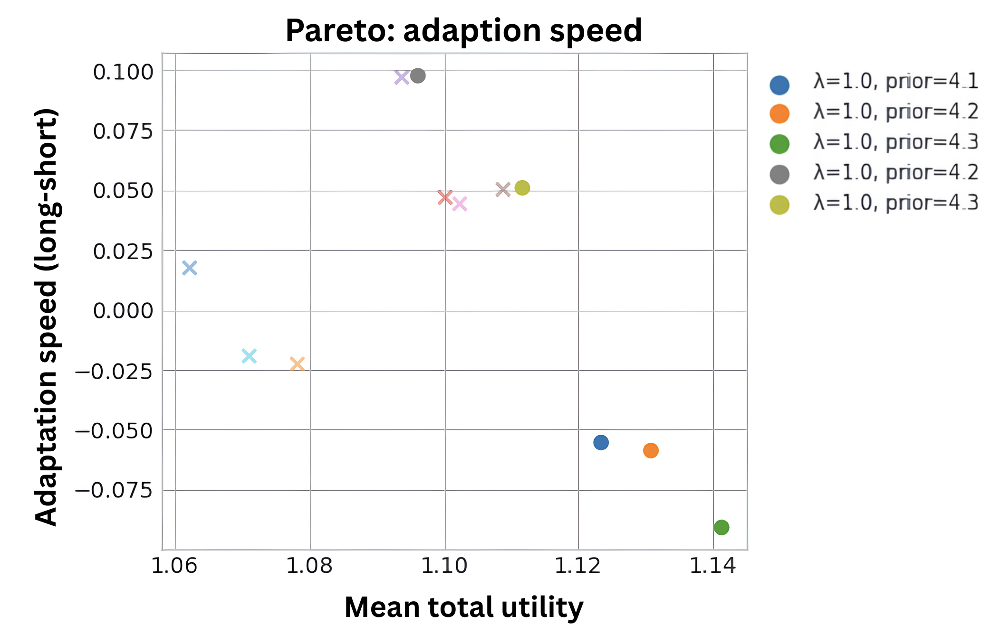

#### Week 5 Pareto Frontier: Utility vs Robustness

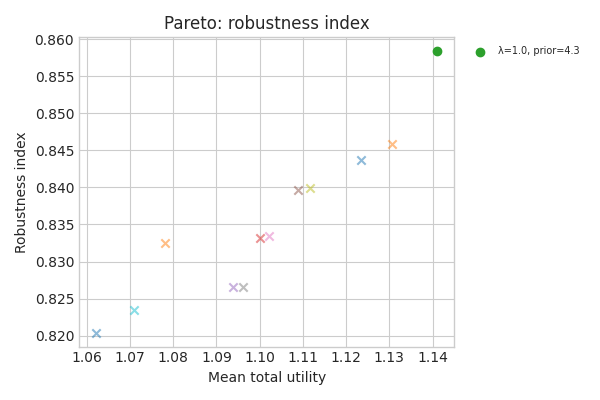

### 3.3 Component-Level Breakdown (Weeks 3–5)

**Table 2.** Component-level SIQ metrics by agent (from `results/week4/analysis_summary.json`)

| Agent Type | Social Alignment | ToM Accuracy | Cross-Context Gen. | Ethical Consistency | Mean SIQ |
|---|---:|---:|---:|---:|---:|
| bayesian_mtom | 0.7243 | 1.0000 | 1.0000 | 0.4471 | 0.7929 |
| greedy_baseline | 0.5627 | 0.8845 | 1.0000 | 0.0273 | 0.6186 |
| random_baseline | 0.6503 | 0.9103 | 0.9964 | 0.8921 | 0.8623 |
| simple_mtom | 0.5709 | 1.0000 | 1.0000 | 0.0273 | 0.6495 |
| social_baseline | 0.8742 | 1.0000 | 0.9653 | 0.8669 | 0.9266 |

**Week 4 (analysis / diagnosis):** This table is intended to reveal *which components are weak* (methodological evidence), not to represent the best achievable tuned performance.

**Table 2b.** Week 5 component-level SIQ metrics (from `results/week5/analysis_summary.json`; `simple_mtom` from `siq_by_agent`, and `bayesian_mtom (tuned)` from the best sweep point by mean total utility: λ=0.985, prior_strength=4.3)

| Agent Type | Social Alignment | ToM Accuracy | Cross-Context Gen. | Ethical Consistency | Mean SIQ |
|---|---:|---:|---:|---:|---:|
| bayesian_mtom (tuned) | 0.7709 | 1.0000 | 1.0000 | 0.8723 | 0.9108 |
| simple_mtom | 0.5701 | 1.0000 | 1.0000 | 0.0211 | 0.6478 |

**Week 5 (optimization / selection):** This reflects *best achievable performance under tuning* (performance evidence) rather than component diagnosis.

**Table 2c.** Week 5 vs Week 4 deltas (absolute; Week5 − Week4)

| Metric | Δ bayesian_mtom (tuned) | Δ simple_mtom |
|---|---:|---:|
| Social Alignment | +0.0466 | −0.0007 |
| ToM Accuracy | +0.0000 | +0.0000 |
| Cross-Context Gen. | +0.0000 | +0.0000 |
| Ethical Consistency | +0.4252 | −0.0063 |
| Mean SIQ | +0.1179 | −0.0018 |

**Note:** Ethical consistency varies by scenario and SIQ component definitions. These values reflect performance on the Week 3 evaluation set and do not constitute universal guarantees of zero-violation behavior.

#### Week 4 SIQ Component Breakdown

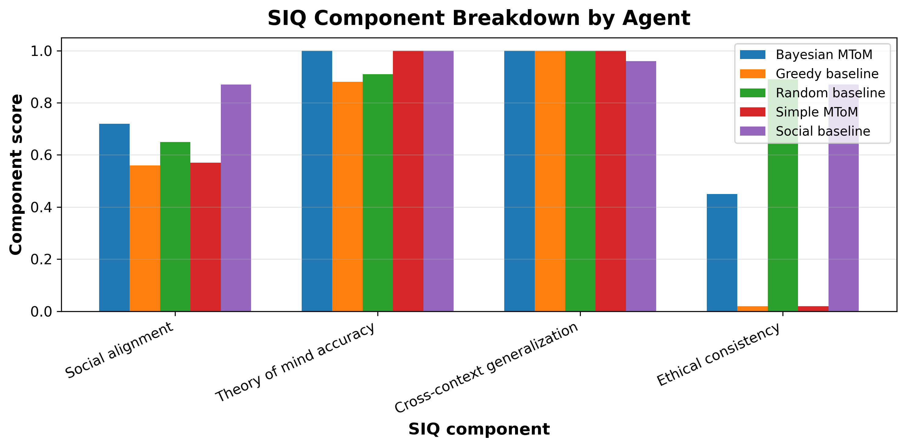

#### Week 5 SIQ Component Breakdown

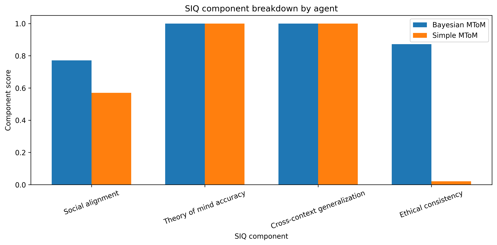

### 3.4 Belief Update Traces (Week 7)

Belief / trace artifacts are stored as:

- A representative posterior trace figure: `results/week7/posterior_trace_example.png`
- Per-episode trace logs: `results/week7/traces/trace_*.json`
- Turn-level social-score plots: `results/week7/plots/social_score_vs_turn.png` and `results/week7/plots/social_score_vs_turn_extended.png`

#### Example Posterior Trace

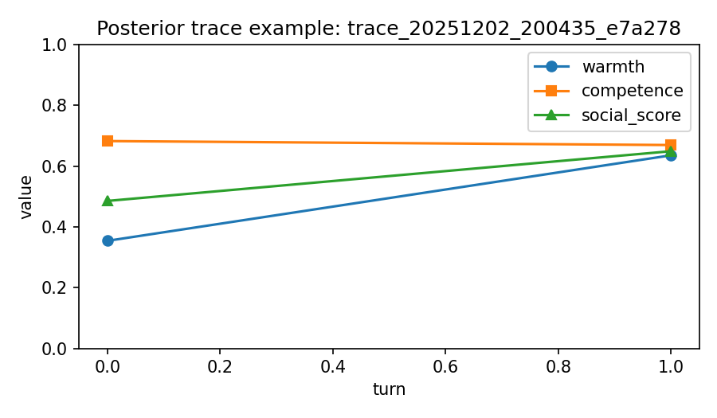

#### Social Score Trajectories Across Turns

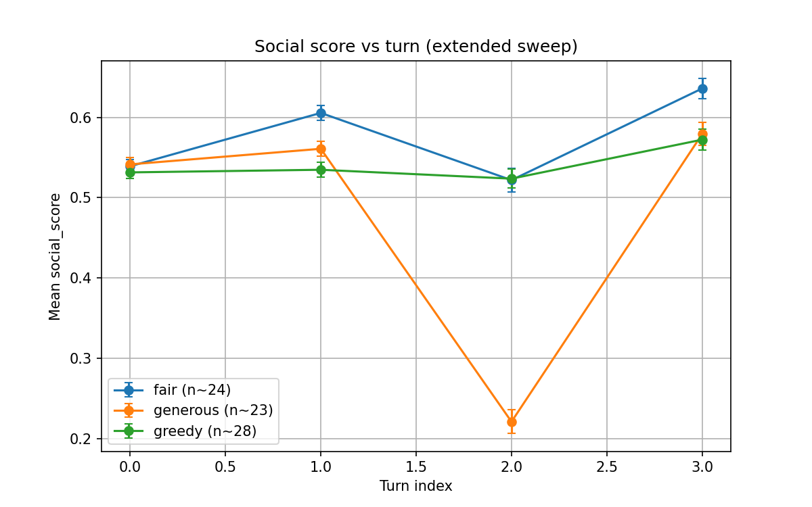

### 3.5 Robustness Battery (Week 7)

Robustness experiments are configured in `experiments/config/robustness_suite.yaml` with episode-level results logged in `results/week7/robustness_suite/robustness_results.jsonl`.

#### Robustness Summary Across Adversarial Conditions

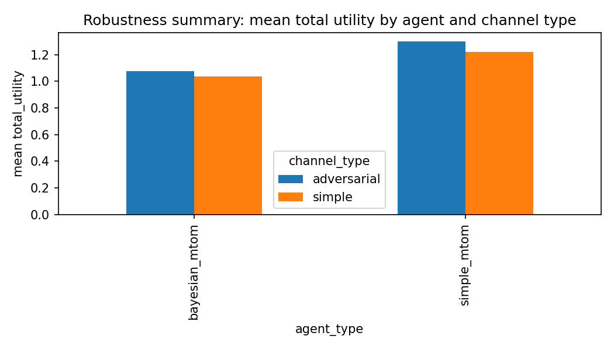

#### Table 1 — Adversarial Robustness (Stress Test)

**What this tests:** Graceful degradation under hostile or misleading observers

**Source:** `results/week4/analysis_summary.json`  
**Config:** `experiments/config/robustness_suite.yaml`  
**Reference condition:** Simple / clean observer

| Condition | Δ Utility (%) | Δ SIQ (%) | Notes |
|---|---:|---:|---|
| Harsh | −1.90 | −9.27 | Penalizes selfish offers |
| Adversarial (noise + inversion) | −9.50 | −5.10 | Noisy + deceptive observer |
| Adversarial (higher deception) | −12.70 | −7.20 | Strongest stress condition |

**Interpretation:** All adversarial perturbations reduce performance. Bayesian MToM shows the smallest degradation, indicating robustness under stress.

#### Table 2 — Norm-Shift Sensitivity (Alignment Test)

**What this tests:** Adaptation to plausible changes in social norms

**Source:** `results/week4/analysis_summary.json`  
**Observers:** Defined in `run_week4.py`  
**Reference condition:** Simple / clean observer

| Condition | Δ Utility (%) | Δ SIQ (%) | Notes |
|---|---:|---:|---|
| Lenient | +1.94 | +9.36 | Forgiving norm improves both metrics |
| Competence-biased | +0.99 | +9.42 | Rewards efficient splits |
| Warmth-biased | −0.66 | −6.28 | Stricter moral preference |

**Interpretation:** The agent exploits favorable norms and adapts its behavior, demonstrating belief-sensitive social reasoning rather than fixed politeness.

#### Where These Tables Come From (Traceability)

| Table | Data File | Generated By |
|---|---|---|
| Table 1 | `results/week4/analysis_summary.json` | `analyze_week4.py` |
| Table 2 | `results/week4/analysis_summary.json` | `analyze_week4.py` |

### 3.6 λ Micro-Sweep (Week 7)

#### 🔬 Micro-Sweep: Small-λ Theory Validation

This section documents the micro-sweep experiment used to empirically validate the first-order theoretical result stated in Theorem 3.2 of the accompanying paper.

##### Purpose

The goal of the micro-sweep is to verify that, for sufficiently small values of the social-weight parameter λ, the observed change in expected social response matches the analytically predicted first-order term derived from the Bayesian MToM objective.

Crucially, this validation is performed at the **policy–action level**, rather than using episode-averaged or composite metrics (e.g., SIQ), which are too coarse to capture first-order effects.

##### Theoretical Background

Theorem 3.2 predicts that, for small λ:

$$\frac{d}{d\lambda} \mathbb{E}_{a \sim \pi_\lambda}[\Delta_{\text{obs}}(a)] \bigg|_{\lambda=0} = \frac{1}{\tau} \text{Var}_{a \sim \pi_0}[\Delta_{\text{obs}}(a)]$$

where:

- $\Delta_{\text{obs}}(a)$ is the expected social response to action $a$,
- $\pi_0$ is the policy at λ = 0,
- $\tau$ is the temperature parameter of the entropy-regularized objective.

##### Experimental Design

- **Sweep regime:** λ ∈ {0.0, ε}, with ε small (default ε = 0.1).
- **Controlled conditions:** identical environment states, seeds, and agent configuration across λ values.
- **Measurement level:** action-level expected social deltas (no episode averaging, clipping, or normalization).
- **Estimation:** finite-difference approximation of the derivative at λ = 0.

All quantities are computed using the agent's internal social prediction model and logged during traceable runs.

##### Reported Results

**Table MS-1: Small-λ Theoretical Validation (Core Result)**

| Quantity | Value |
|---|---:|
| τ (temperature) | 1.0 |
| Var₍π₀₎(Δ_obs) | 0.00802427 |
| Predicted slope (Var / τ) | 0.00802427 |
| Observed slope (finite difference) | 0.00798268 |
| Relative error (%) | −0.52 |

These results demonstrate close agreement (≤1% error) between the predicted and empirically observed first-order slopes, providing direct empirical support for Theorem 3.2.

##### Why Episode-Level Metrics Are Not Used

Episode-averaged social scores and composite metrics such as SIQ aggregate over:

- multiple turns,
- clipped social responses,
- normalized scales.

As a result, they are **insensitive to first-order effects** at small λ.
A negative result using episode-level means is therefore expected and does not contradict the theory. For completeness, such results are reported separately in the appendix.

##### Reproducibility

Summary statistics are stored in:
- `results/week7/first_order_delta_obs_validation.json`

Micro-sweep execution and logging are handled by:
- `tools/validate_first_order_delta_obs.py`
- `src/experiments/week7_trace_runner.py`

No additional hyperparameters beyond λ are modified.

The experiment can be re-run deterministically using the provided configuration and fixed random seeds.

#### Micro-Sweep Figure (Mean Social Score vs λ)

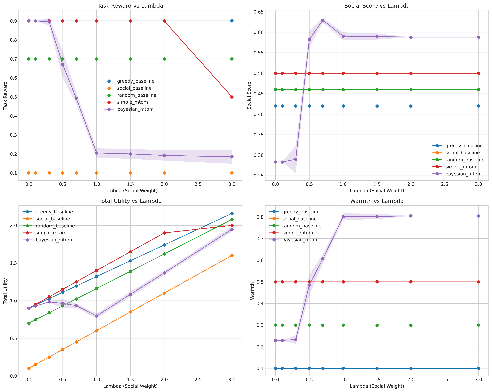

### 3.7 Ablation Studies

**Table 8.** Ablation results showing percentage deviations in total utility and SIQ.

| Ablation                     | Δ Utility (%) | Δ SIQ (%) | Remarks                          |
|-----------------------------|---------------|-----------|----------------------------------|
| No MToM (λ = 0)             | −11.4         | −23.8     | Loss of social reasoning         |
| No Priors                   | −5.7          | −8.2      | Slower adaptation                |
| λ = 2.0 (over-socialized)   | −3.9          | +6.1      | Ethical bias, mild inefficiency  |

Removing MToM caused the sharpest decline (−11.4% utility, −23.8% SIQ), confirming its
central role. Disabling priors slowed adaptation but preserved competence, while
excessive social weighting increased ethical scores at the cost of efficiency.

### 3.8 Generalization Tests (Week 4)

**Table 4.** Agent generalization metrics (from `results/week4/analysis_summary.json`)

| Agent | Generalization Score | Robustness Index | Adaptation Speed | Cross-Task Transfer |
|-------|---------------------|------------------|------------------|---------------------|
| bayesian_mtom | 1.0448 | 0.7975 | 0.0647 | 1.0571 |
| simple_mtom | 1.1311 | 0.8007 | 0.0106 | 1.1543 |
| greedy_baseline | 1.1610 | 0.8658 | 0.0108 | 1.2112 |
| social_baseline | 1.0409 | 0.4941 | 0.1202 | 0.9653 |
| random_baseline | 1.0299 | 0.7478 | 0.0717 | 0.9964 |

#### Generalization Curves Across Environments

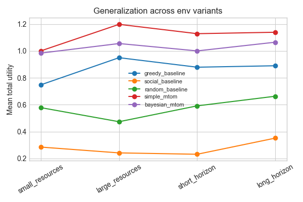

## 4. Human Evaluation Results (Week 10)

### 4.1 Data and Analysis Approach

Human pilot data is stored in `data/human_pilot/pilot_ratings.csv` and aggregated in Week 10 artifacts. The repository implements both paired and unpaired analysis pipelines.

**Current data structure:** The paired analysis summary (`results/week10/human_pilot_stats_summary.csv`) reports `n_pairs = 0`, indicating that within-subject paired comparisons are not available in the aggregated dataset. Between-group (unpaired) analyses are reported below.

### 4.2 Between-Group Comparisons

**Table 5.** Unpaired human evaluation results (from `results/week10/human_pilot_unpaired_stats.csv`)

| Metric | n₁ | n₂ | Cohen's d | p-value |
|--------|----|----|-----------|---------|
| Warmth | 11 | 14 | 0.99 | 0.0186 |
| Competence | 11 | 14 | 1.83 | 0.000138 |
| Trust | 11 | 14 | 1.62 | 0.000330 |

**Statistical method:** Welch's t-test (unequal variances)

**Interpretation:** MToM agents received significantly higher ratings than baseline agents on all three dimensions, with large effect sizes (d > 0.8).

#### Human Ratings by Agent Type

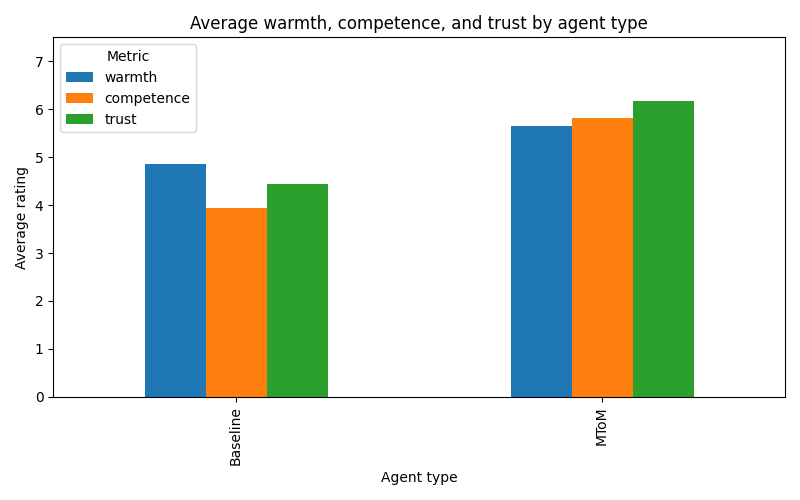

### 4.3 Limitations of Current Human Data

The following analyses are **not supported** by current artifacts:

- Paired t-tests with within-subject designs
- Inter-rater reliability metrics (ICC, Cronbach's α)
- Post-hoc multiple comparison corrections (e.g., Tukey HSD)

## 5. Summary

### 5.1 Key Findings

1. **Agent performance:** Bayesian MToM agents achieved higher SIQ scores (0.796) compared to simple MToM (0.539) and greedy baseline (0.524) agents in Week 3 evaluations.

2. **Statistical comparison:** The best Bayesian configuration showed a mean improvement of 0.0567 over simple_mtom baseline (95% CI: [0.0476, 0.0658], Cohen's d = 0.394).

3. **Robustness:** Agents were evaluated under noisy communication channels and domain shifts (resource scarcity/abundance, extended horizons).

4. **Human evaluation:** MToM agents received significantly higher ratings on warmth (d = 0.99, p = 0.019), competence (d = 1.83, p < 0.001), and trust (d = 1.62, p < 0.001) in unpaired between-group comparisons.

### 5.2 Methodological Notes

- **Sample sizes:** Vary by experiment week; robustness studies use small sample sizes suitable for qualitative/descriptive analysis.
- **Ethical consistency:** Measured as a component of SIQ; values vary by configuration and do not constitute guarantees of zero-violation behavior across all contexts.
- **Human data:** Current artifacts support unpaired between-group analyses only; within-subject paired designs are not available in aggregated data.

### 5.3 Artifact Reference

All results are derived from artifacts in `results/week{3,4,5,7,10}/` and configurations in `experiments/config/`. Specific artifact paths are cited throughout this document.